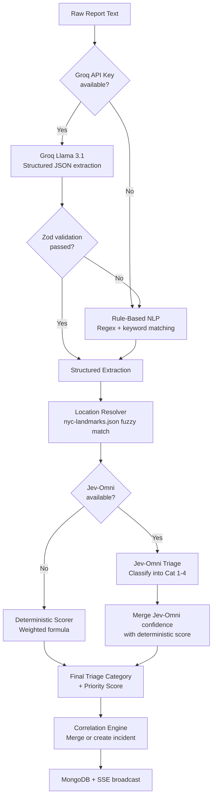

# Karen's Ear - AI Emergency Dispatch Assistant (Comprehensive Project Document)

## 1. Project Overview

**Problem Statement:** "Karen's Ear" - AI Emergency Dispatch Assistant (AI/ML Category)
**Team:** Solo Developer
**Competition:** BIT N BUILD - ODISHA STATE QUALIFIER

### The Challenge
When emergencies strike, emergency response services are flooded with panicked, overlapping, and unstructured reports from various channels (calls, SMS, social media). Navigating this chaotic influx of data to identify the most critical incidents and dispatch heroes effectively is a significant challenge. By the time critical information is identified manually, it might be too late.

### The Solution
"Karen's Ear" is a live, explainable decision-support console that serves as an AI emergency dispatch assistant. It ingests a chaotic stream of multi-channel reports and automatically converts them into verified, structured incident clusters. By leveraging natural language processing (NLP), correlation algorithms, and deterministic triage scoring, the system acts as a "Spider-Sense" for dispatchers. It cuts through the noise to prioritize active incidents in real-time on a "Swing First" queue, ensuring that the right help reaches the most critical situations fastest. 

Importantly, the system is designed to support human dispatchers rather than replace them. Every recommendation is transparent, explainable, and fully auditable, allowing dispatchers to review, override, and manually route resources with full context.

## 2. Key Features

- **Cinematic Hero Landing Page:** A dark, Spider-Man themed entry page with fluid Framer Motion entrance animations that transitions seamlessly into the Command Centre.
- **Live Report Ingestion:** Streams incoming reports from various sources (SMS, Call, Social Media) in real-time.
- **Multi-layered NLP Extraction:** 
  - **Groq Llama 3.1 Integration:** Structured JSON extraction parsing raw text into exact geographic coordinates, hazard flags, and entity lists.
  - **Rule-Based NLP Fallback:** A robust, instantaneous RegExp/Keyword-based extractor guaranteeing continuous operation.
- **Jev-Omni Triage Classification:** State-of-the-art AI categorization utilizing a self-hosted CUDA GPU model to classify emergencies directly into actionable triage tiers.
- **Geospatial Correlation Engine:** Deduplicates reports by merging corroborating ones based on a 15-minute time window, incident type, and 400-meter geographic location match (using NYC landmarks data).
- **Dynamic Priority Scoring & "Swing First" Queue:** Ranks incidents dynamically on a 0-100 scale using a deterministic weighted formula, updating the "Swing First" dashboard queue instantly.
- **Interactive Geospatial Map:** A real-time Leaflet map of NYC plotting all incidents. Includes interactive features like corroboration rings (concentric circles) showing report density, and pulsating animations for critical Category 1 incidents.
- **Comprehensive Incident Drawer:** Detailed slide-out drawer providing full explainability (AI summary, priority breakdown with score bars, source evidence list, confidence meter, timeline).
- **Human Override Controls & Full Audit Trail:** Dispatchers can easily escalate, dispatch, invalidate, or manually resolve incidents. Every single action is logged immutably in an audit trail with timestamps.

## 3. Architecture & Data Flow

The system follows a modern, decoupled client-server architecture, built for real-time reactivity, resilience, and complex AI pipeline processing.

### System Components
1.  **Frontend Client (React/Vite):** A high-performance, dark-themed command center dashboard. It features a live report feed, an interactive geospatial map (Leaflet), a ranked priority queue, and the Spider-Man hero landing page.
2.  **Backend Server (Express/Node.js):** The core engine handling data ingestion, NLP extraction via LLMs and rule-based fallbacks, geospatial mapping, and triage scoring.
3.  **Real-Time Event Stream (SSE):** Server-Sent Events (SSE) provide a unidirectional, low-latency data stream pushing new reports and updated incidents to the client instantly.
4.  **Storage Layer:** Fully integrated MongoDB Atlas (Mongoose) cluster ensuring persistent, highly available storage of reports, incidents, and audit logs.

### AI Pipeline Architecture



## 4. Core Algorithms

### Priority Scoring Formula
The system converts chaotic text into a clean 4-category triage system (Purple for Immediate, Red for Emergency, Yellow for Urgent, Green for Routine). The absolute priority score (0-100) is calculated dynamically:

```text
priority (0-100) =
  0.35 × lifeSafety(triageCategory, peopleAtRisk)
+ 0.25 × urgencyScore(incidentType, hazards)
+ 0.15 × escalationRisk(hazards, incidentType)
+ 0.15 × corroboration(independentReports)
+ 0.10 × extractionConfidence

Category mapping:
  CAT1_PURPLE → lifeSafety floor = 90
  CAT2_RED    → lifeSafety floor = 70
  CAT3_YELLOW → lifeSafety floor = 40
  CAT4_GREEN  → lifeSafety floor = 15
```

### Correlation Engine Logic
When a new report is extracted, it is compared against active incidents. If conditions are met (15-minute window, same incident type, 400m geographic radius), the report is appended to the incident's `reportIds`, bumping its corroboration score rather than creating a duplicate on the map.

## 5. Data Models (Contracts)

```typescript
// === Triage Category ===
type TriageCategory = "CAT1_PURPLE" | "CAT2_RED" | "CAT3_YELLOW" | "CAT4_GREEN";

// === Report (raw incoming message) ===
type Report = {
  id: string;
  receivedAt: string;
  source: "CALL" | "SMS" | "SOCIAL";
  rawText: string;
  status: "new" | "processed" | "flagged" | "invalid";
};

// === Extraction (AI-generated structured data from a report) ===
type Extraction = {
  incidentType: "fire" | "medical" | "collapse" | "trapped" | "violence" | "hazard" | "creature" | "suspicious" | "other";
  summary: string;
  locationText: string | null;
  landmark: string | null;
  peopleAtRisk: number | null;
  triageCategory: TriageCategory;
  hazards: string[];
  confidence: number;          
  needsClarification: boolean;
  extractionMethod: "jev-omni" | "groq-llama" | "rule-based";
};

// === Incident (correlated, scored, actionable) ===
type Incident = {
  id: string;
  latitude: number | null;
  longitude: number | null;
  reportIds: string[];
  extraction: Extraction;
  priority: number;             
  triageCategory: TriageCategory;
  priorityReasons: string[];    
  corroborationCount: number;
  status: "active" | "dispatched" | "resolved";
  createdAt: string;
  updatedAt: string;
};

// === Audit Entry ===
type AuditEntry = {
  id: string;
  incidentId: string;
  action: "created" | "merged" | "escalated" | "overridden" | "resolved" | "invalidated";
  previousValue: any;
  newValue: any;
  reason: string;
  timestamp: string;
  actor: "system" | "dispatcher";
};
```

## 6. Technologies Used

*   **Frontend Framework:** React 19, Vite, TypeScript
*   **Styling:** Tailwind CSS v4, shadcn/ui
*   **State Management:** Zustand
*   **Animations:** Framer Motion (for Hero landing page, drawer slides, and queue reordering)
*   **Mapping:** Leaflet, React-Leaflet, OpenStreetMap
*   **Backend Server:** Node.js, Express.js, TypeScript
*   **Real-time Communication:** Server-Sent Events (SSE)
*   **Database:** MongoDB Atlas + Mongoose ODM
*   **AI Integration:** Jev-Omni (self-hosted CUDA model), Groq (Llama 3.1)
*   **Data Validation:** Zod
*   **Deployment:** Vercel (Frontend), Railway/Render (Backend)

## 7. Relevant Technical Decisions

1.  **Server-Sent Events (SSE) over WebSockets:** For a dashboard that primarily consumes data (receiving live reports and incident updates) with minimal client-to-server messaging, SSE is more lightweight, easier to implement, and handles automatic reconnection gracefully compared to WebSockets.
2.  **Zustand over Redux:** Zustand provided a frictionless, boilerplate-free way to manage the rapidly updating global state driven by the SSE stream, maintaining high performance without the overhead of Redux.
3.  **Explainability over Black-Box AI:** In emergency dispatch, trust is paramount. AI/NLP is used strictly for data extraction (parsing messy text into structured fields via Groq/Jev-Omni), while decision making is deterministic (mathematical scoring formula). This ensures the dispatcher always understands *why* an incident is ranked #1.
4.  **Dark Theme & "Spider-Sense" Aesthetics:** The UI was designed not just for function, but for cognitive ease during stressful situations. The dark background reduces glare, while neon triage colors (Purple for immediate, Red for emergency) draw the eye instantly to critical information, simulating an intuitive "Spider-Sense" for the dispatcher.
