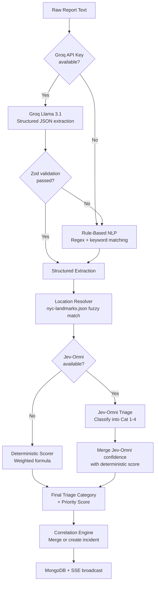

# Karen's Ear — Implementation Plan (5-Hour Sprint)

> **Constraint:** Solo developer, 5 hours remaining. Every minute counts.

---

## Confirmed Tech Stack

| Layer | Choice |
|---|---|
| **Frontend** | Vite + React + TypeScript |
| **Styling** | Tailwind CSS v4 + shadcn/ui |
| **Animations** | Framer Motion |
| **State Management** | Zustand |
| **Map** | Leaflet + OpenStreetMap |
| **Backend** | Express.js + TypeScript (Node.js) |
| **Database** | MongoDB Atlas (free tier) + Mongoose ODM |
| **Real-time** | Server-Sent Events (SSE) |
| **Primary AI** | Jev-Omni (self-hosted, CUDA GPU) — classification/triage |
| **Optional AI** | Groq (Llama 3.1) — structured JSON extraction (fallback: rule-based NLP) |
| **Validation** | Zod (shared schemas) |
| **Deploy** | Vercel (frontend) + Railway/Render (backend) |
| **Theme** | Dark command-centre + Spider-Man red/blue accents |

### Triage Categories (replacing 1-5 numeric scale)

| Category | Color | Meaning |
|---|---|---|
| **Cat 1** | 🟣 Purple | Immediate life-saving intervention needed |
| **Cat 2** | 🔴 Red | Emergency response (strokes, major burns) |
| **Cat 3** | 🟡 Yellow | Urgent (pain control, stable injuries) |
| **Cat 4** | 🟢 Green | Less urgent, routine triage |

### Simulated Feed
- Auto-feed every 5-15 seconds + manual inject button
- Pre-scripted scenarios covering all 4 categories + duplicates

---

## Project Structure

```
Bit and Build 2026/
├── karen-ear-client/          # Vite + React + TS (separate repo)
│   ├── src/
│   │   ├── components/
│   │   │   ├── layout/        # Header, Sidebar, MainLayout
│   │   │   ├── map/           # MapView, IncidentMarker
│   │   │   ├── feed/          # ReportFeed, ReportCard
│   │   │   ├── queue/         # PriorityQueue, IncidentCard
│   │   │   ├── drawer/        # IncidentDrawer, EvidencePanel, AuditLog
│   │   │   └── hero/          # SpiderMan hero landing page
│   │   ├── stores/            # Zustand stores
│   │   │   ├── incidentStore.ts
│   │   │   ├── reportStore.ts
│   │   │   └── uiStore.ts
│   │   ├── hooks/             # useSSE, useMap, etc.
│   │   ├── lib/               # utils, constants, triage colors
│   │   ├── types/             # Shared TypeScript types
│   │   └── App.tsx
│   ├── tailwind.config.ts
│   └── package.json
│
├── karen-ear-server/          # Express + TS (separate repo)
│   ├── src/
│   │   ├── routes/
│   │   │   ├── reports.ts     # POST /api/reports, GET /api/reports
│   │   │   ├── incidents.ts   # GET /api/incidents, PATCH override
│   │   │   └── sse.ts         # GET /api/stream (SSE endpoint)
│   │   ├── services/
│   │   │   ├── extraction.ts  # AI extraction pipeline
│   │   │   ├── correlation.ts # Incident merging/dedup
│   │   │   ├── triage.ts      # Deterministic priority scorer
│   │   │   └── feed.ts        # Simulated report generator
│   │   ├── models/            # Mongoose schemas
│   │   │   ├── Report.ts
│   │   │   ├── Incident.ts
│   │   │   └── AuditLog.ts
│   │   ├── ai/
│   │   │   ├── jevOmni.ts     # Jev-Omni client (HTTP to local GPU)
│   │   │   ├── groqClient.ts  # Optional Groq/Llama extraction
│   │   │   └── ruleBasedNLP.ts # Fallback extraction without LLM
│   │   ├── data/
│   │   │   ├── nyc-landmarks.json
│   │   │   └── scenario-reports.json
│   │   ├── types/             # Shared types (mirror client)
│   │   └── index.ts           # Express app entry
│   └── package.json
```

---

## ⏱️ 5-Hour Build Order (Solo Developer)

> [!CAUTION]
> With 5 hours, you CANNOT build everything. This plan is ruthlessly prioritized.
> Cut Jev-Omni integration to Phase 2 if model loading takes > 30 min.

---

### Hour 1 (0:00–1:00) — Foundation & Data Pipeline

**Goal:** Both apps scaffold, shared types defined, backend serves fixture data, SSE works.

| Min | Task | Details |
|-----|------|---------|
| 0-10 | Scaffold both projects | `npm create vite@latest karen-ear-client -- --template react-ts` and Express+TS boilerplate for server |
| 10-20 | Define shared types | `Report`, `Extraction`, `Incident`, `AuditEntry` types with Zod schemas. Use the 4-category triage enum |
| 20-30 | Create fixture data | `nyc-landmarks.json` (15-20 locations with coords) + `scenario-reports.json` (15-20 scripted reports covering all 4 categories) |
| 30-40 | Mongoose models + MongoDB Atlas | Connect to Atlas, define Report/Incident/AuditLog Mongoose schemas |
| 40-50 | Express routes skeleton | `POST /api/reports`, `GET /api/incidents`, `PATCH /api/incidents/:id/override`, `GET /api/stream` (SSE) |
| 50-60 | SSE endpoint working | Server pushes new reports and incident updates to connected clients |

**Checkpoint ✓:** `curl` can POST a report and see it echoed via SSE stream.

---

### Hour 2 (1:00–2:00) — AI Pipeline & Core Logic

**Goal:** Reports go in → structured extractions come out → incidents are created and scored.

| Min | Task | Details |
|-----|------|---------|
| 0-15 | Rule-based NLP extractor | Regex + keyword matching for incident type, location (match against landmarks), severity signals ("trapped", "fire", "bleeding"). This is the **guaranteed fallback** |
| 15-30 | Groq/Llama integration (optional) | If Groq API key available: send report text with JSON schema prompt, validate with Zod, fall back to rule-based on failure |
| 30-40 | Location resolver | Match extracted location text against `nyc-landmarks.json` aliases. Fuzzy match with simple string similarity |
| 40-50 | Correlation engine | Match by: same incident type + same/nearby landmark + within 15 min window. Merge into existing incident or create new |
| 50-60 | Deterministic triage scorer | 4-category assignment based on: `lifeSafety * 0.35 + urgency * 0.25 + escalation * 0.15 + corroboration * 0.15 + confidence * 0.10`. Map score ranges to Purple/Red/Yellow/Green |

**Checkpoint ✓:** POST a report → see a scored, categorized incident in the DB with priority reasons.

---

### Hour 3 (2:00–3:00) — Frontend Dashboard Core

**Goal:** The main dispatch dashboard is functional with live data.

| Min | Task | Details |
|-----|------|---------|
| 0-10 | Tailwind + shadcn/ui setup | Install Tailwind v4, init shadcn, set up dark theme with Spider-Man accent colors (red `#E23636`, blue `#2B3784`, purple `#7B2D8E`) |
| 10-15 | Zustand stores | `incidentStore` (incidents, selected, SSE connection), `reportStore` (raw feed), `uiStore` (drawer open, filters) |
| 15-20 | SSE hook | `useSSE()` hook that connects to `/api/stream` and pushes updates into Zustand stores |
| 20-30 | Layout shell | Dark header with system stats, 3-column layout (feed | map | queue) |
| 30-40 | Leaflet map | NYC-centered map with dark tiles, incident markers colored by triage category, sized by priority |
| 40-50 | Priority queue (right rail) | Sorted incident cards with category badge, summary, corroboration count, "why first" rationale |
| 50-60 | Report feed (left rail) | Scrolling list of raw reports with color-coded processing status |

**Checkpoint ✓:** Dashboard shows live incidents on map and in sorted queue as reports stream in.

---

### Hour 4 (3:00–4:00) — Interactivity & Polish

**Goal:** Incident drawer, human overrides, animations, and the demo scenario.

| Min | Task | Details |
|-----|------|---------|
| 0-15 | Incident drawer | Click a card or marker → slide-out drawer with: AI summary, priority breakdown (score bars for each factor), source evidence list, confidence meter, timeline |
| 15-25 | Human override controls | In drawer: "Mark Invalid", "Escalate", "Override Priority" buttons. Each creates an audit log entry with timestamp and reason |
| 25-35 | Framer Motion animations | `AnimatePresence` for queue reordering, `layoutId` for card transitions, pulse animation on new incidents, drawer slide |
| 35-45 | Simulated feed controls | Auto-feed toggle (5-15s interval), manual inject button, scenario selector dropdown |
| 45-55 | Map interactions | Click marker → select incident, popup with quick summary, corroboration rings (concentric circles), pulsing for Cat 1 |
| 55-60 | Error/empty/loading states | Skeleton loaders, "No incidents" empty state, API error toasts |

**Checkpoint ✓:** Full interactive loop: report arrives → extraction → map marker + queue card → click → drawer → override → audit log.

---

### Hour 5 (4:00–5:00) — Hero Page, Deploy & Demo

**Goal:** Spider-Man hero page, deployment, demo rehearsal.

| Min | Task | Details |
|-----|------|---------|
| 0-10 | Spider-Man hero/landing page | Dark, cinematic entry with Spider-Man theme. Framer Motion entrance animations. "Enter Command Centre" CTA → dashboard |
| 10-15 | Header stats polish | Reports/min counter, active incidents count, last processed timestamp, system status indicator |
| 15-25 | Deploy frontend to Vercel | `vercel --prod`, set env vars (API URL) |
| 25-35 | Deploy backend to Railway | Push, set env vars (MongoDB URI, Groq key if available), verify SSE works cross-origin (CORS) |
| 35-45 | Demo scenario test | Run the full scripted scenario: chaos → extraction → duplicate merge → top recommendation → human override. Fix any bugs |
| 45-55 | README + architecture diagram | Quick README with setup instructions, `.env.example`, architecture mermaid diagram |
| 55-60 | Final test + record demo | Test deployed URL in incognito, record 90-second demo video |

---

## Critical Data Contracts (Updated)

```typescript
// === Triage Category (replaces numeric 1-5 severity) ===
type TriageCategory = "CAT1_PURPLE" | "CAT2_RED" | "CAT3_YELLOW" | "CAT4_GREEN";

// === Report (raw incoming message) ===
type Report = {
  id: string;
  receivedAt: string;
  source: "CALL" | "SMS" | "SOCIAL";
  rawText: string;
  status: "new" | "processed" | "flagged" | "invalid";
};

// === Extraction (AI-generated structured data from a report) ===
type Extraction = {
  incidentType: "fire" | "medical" | "collapse" | "trapped" | "violence"
    | "hazard" | "creature" | "suspicious" | "other";
  summary: string;
  locationText: string | null;
  landmark: string | null;
  peopleAtRisk: number | null;
  triageCategory: TriageCategory;
  hazards: string[];
  confidence: number;          // 0-1
  needsClarification: boolean;
  extractionMethod: "jev-omni" | "groq-llama" | "rule-based";
};

// === Incident (correlated, scored, actionable) ===
type Incident = {
  id: string;
  latitude: number | null;
  longitude: number | null;
  reportIds: string[];
  extraction: Extraction;
  priority: number;             // 0-100
  triageCategory: TriageCategory;
  priorityReasons: string[];    // human-readable rationale
  corroborationCount: number;
  status: "active" | "dispatched" | "resolved";
  createdAt: string;
  updatedAt: string;
};

// === Audit Entry ===
type AuditEntry = {
  id: string;
  incidentId: string;
  action: "created" | "merged" | "escalated" | "overridden" | "resolved" | "invalidated";
  previousValue: any;
  newValue: any;
  reason: string;
  timestamp: string;
  actor: "system" | "dispatcher";
};
```

---

## AI Pipeline Architecture



### Jev-Omni Integration Pattern

```typescript
// How to call Jev-Omni for triage classification
const result = classifier.predict({
  state: `Incident report: "${report.rawText}". 
          Extracted: ${extraction.summary}. 
          People at risk: ${extraction.peopleAtRisk ?? 'unknown'}. 
          Hazards: ${extraction.hazards.join(', ') || 'none identified'}.`,
  question: "What is the appropriate triage category for this incident?",
  options: [
    "Category 1 (Purple): Immediate life-saving intervention needed",
    "Category 2 (Red): Emergency response for conditions like strokes or major burns",
    "Category 3 (Yellow): Urgent response for pain control or stable injuries",
    "Category 4 (Green): Less urgent, routine triage assessments"
  ]
});
// result.probabilities → use highest probability as triage, display calibrated confidence
```

---

## Priority Scoring Formula (Updated for 4-Category System)

```
priority (0-100) =
  0.35 × lifeSafety(triageCategory, peopleAtRisk)
+ 0.25 × urgencyScore(incidentType, hazards)
+ 0.15 × escalationRisk(hazards, incidentType)
+ 0.15 × corroboration(independentReports)
+ 0.10 × extractionConfidence

Category mapping:
  CAT1_PURPLE → lifeSafety floor = 90
  CAT2_RED    → lifeSafety floor = 70
  CAT3_YELLOW → lifeSafety floor = 40
  CAT4_GREEN  → lifeSafety floor = 15
```

---

## ⚠️ 5-Hour Risk Mitigation

| Risk | Mitigation |
|------|------------|
| Jev-Omni takes too long to set up | **Cut it.** Rule-based NLP + optional Groq is a complete pipeline. Add Jev-Omni as "Phase 2" in the README |
| MongoDB Atlas connection issues | Fallback: in-memory Map store with same interface. Switch in < 5 minutes |
| Groq rate limits during demo | Fixture-mode: pre-computed extractions for demo reports, skip API call |
| SSE doesn't work cross-origin | CORS headers on Express + retry logic in the SSE hook |
| Vercel/Railway deploy fails | Local demo with `npm run dev` on both + ngrok tunnel |
| 5 hours is not enough | **Cut scope in this order:** Hero page → Framer Motion animations → Groq integration → audit log UI → map corroboration rings |

---

## Cut Order (if running out of time)

1. 🔪 Spider-Man hero page → go straight to dashboard
2. 🔪 Framer Motion animations → CSS transitions only
3. 🔪 Groq integration → rule-based NLP only
4. 🔪 Audit log UI → backend stores it but no drawer tab
5. 🔪 Map corroboration rings → simple markers only
6. 🔪 Deployment → local demo with screen recording
7. ❌ **NEVER CUT:** Triage scoring, priority queue, incident drawer, basic map

---

> [!IMPORTANT]
> **The winning demo needs exactly 5 things working perfectly:**
> 1. A report arrives and gets processed visually
> 2. Two reports about the same fire merge into one incident
> 3. The priority queue ranks a Cat 1 (Purple) above a Cat 4 (Green)  
> 4. The incident drawer shows "why this is #1" with a readable rationale
> 5. The dispatcher overrides something and the queue re-sorts
>
> **Everything else is polish.** Build these 5 first.
